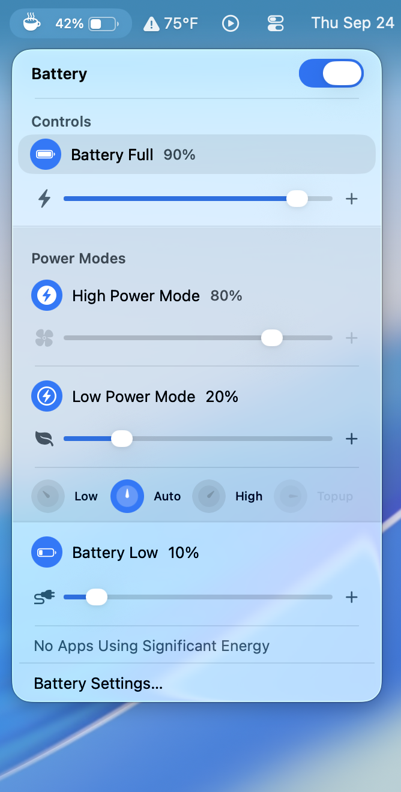
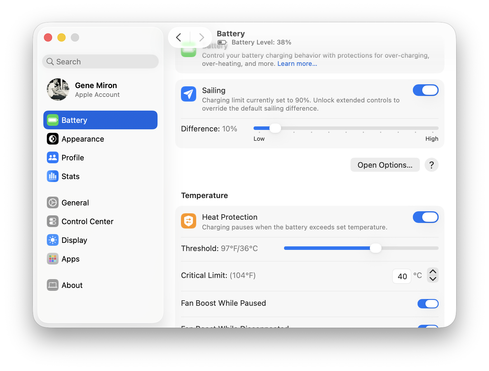
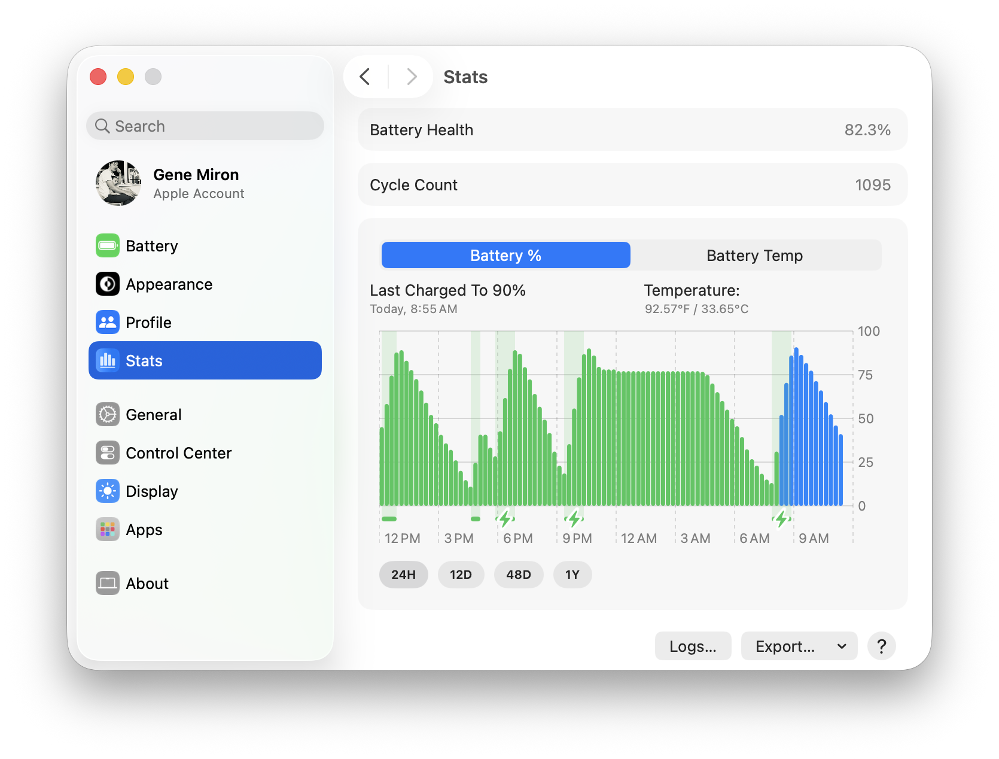
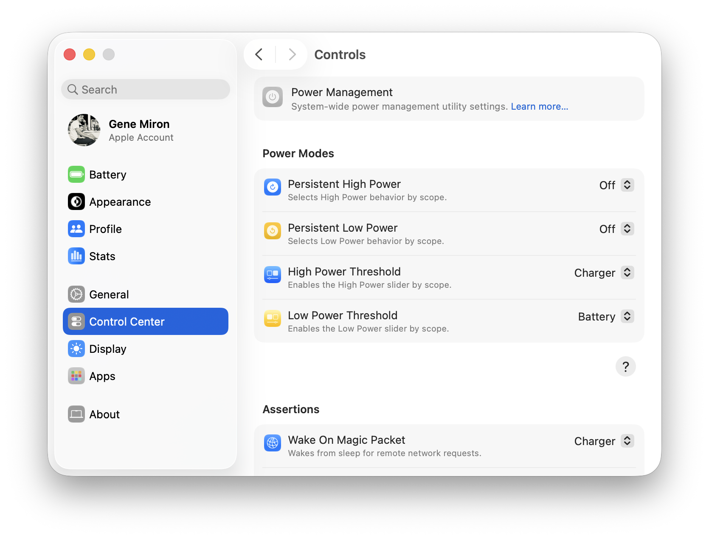
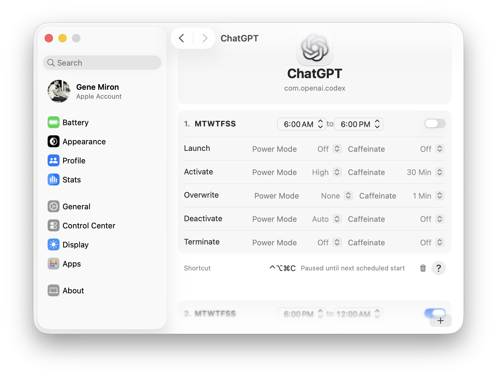
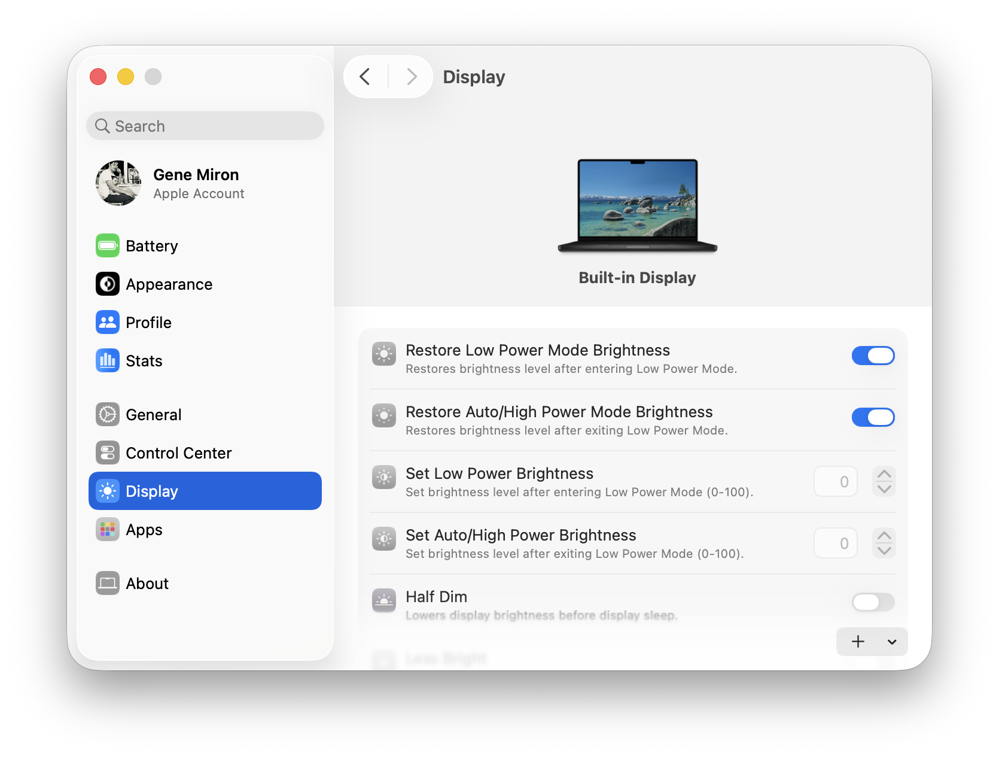
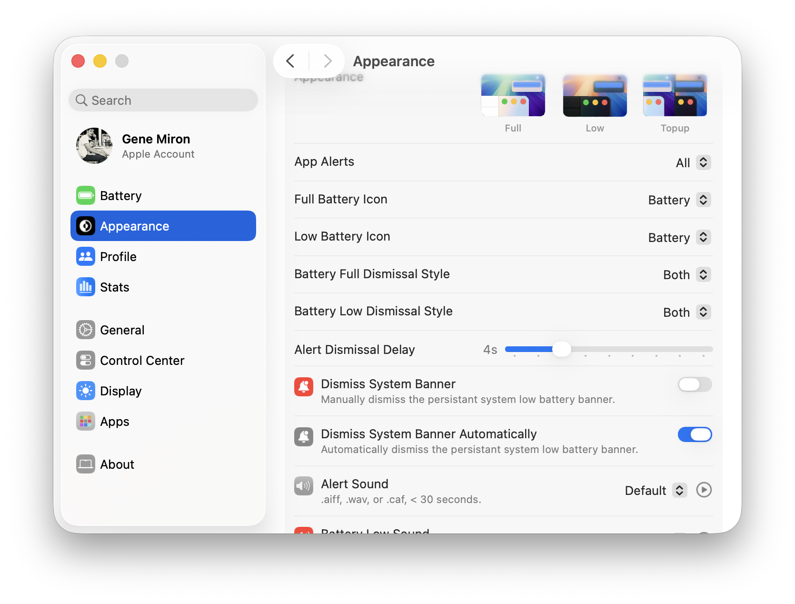

<picture>
  <source media="(prefers-color-scheme: dark)" srcset="SocialPreviewDark.png">
  <source media="(prefers-color-scheme: light)" srcset="SocialPreview.png">
  
</picture>

# Tethered

Tethered is a macOS app for managing your Mac's battery, power modes, and sleep behavior. It brings charging controls, power settings, and battery history into one place, with quick access from the menu bar.

## What you can do

- **Manage charging:** Set a charging limit, use Sailing to let the battery discharge before charging resumes, and pause charging when the battery gets too warm.
- **Control power and sleep:** Choose High or Low Power behavior, configure wake and sleep settings, and use Caffeinate when you need your Mac to stay awake.
- **Automate routines:** Apply power mode and Caffeinate actions when selected apps launch, activate, deactivate, or quit. Use keyboard shortcuts and Apple Shortcuts for frequent actions.
- **Save your setup:** Create profiles for different settings and configure battery calibration schedules.
- **Calibrate your battery:** Start a calibration cycle when you choose, or let Tethered schedule one according to your calibration policy.
- **See battery history:** Check battery health and cycle count, and explore charge level and temperature over time.
- **Make it yours:** Adjust display brightness behavior across power modes, customize battery alerts, and manually or automatically dismiss the persistent macOS low battery banner.

## Pro Access

Pro Access is **$6.99 per device**. It unlocks extended charging controls and heat protection options, power mode thresholds and system controls, app-based automation, Caffeinate presets, additional keyboard shortcuts and Apple Shortcuts actions, iCloud settings sync, and more alert customization. You can purchase or check access for this Mac in Tethered's Pro Access settings.

## Your data

Tethered keeps your settings and battery history locally on your Mac. With Pro Access, you can enable iCloud sync for your settings and assets, or back up and restore them through your iCloud account. Battery history remains available locally in Tethered's Application Support folder.

You can manage settings in the app, view battery health and charge history in **Stats**, and export battery health history as **CSV or JSON**. Tethered also lets you export its logs. Open **Account → iCloud** to find the local data location and iCloud backup controls.

## Screenshots

### Menu bar controls

| Battery and charging | Battery history |
| --- | --- |
|  |  |

| Power controls | App automation |
| --- | --- |
|  |  |

| Display settings | Alerts and appearance |
| --- | --- |
|  |  |

## Get Tethered

Download the macOS installer from [GitHub Releases](https://github.com/Tumerit/Tethered/releases). The `.pkg` file is for manual installation; the `.Sparkle.zip` file is used by the app's built-in updater.
